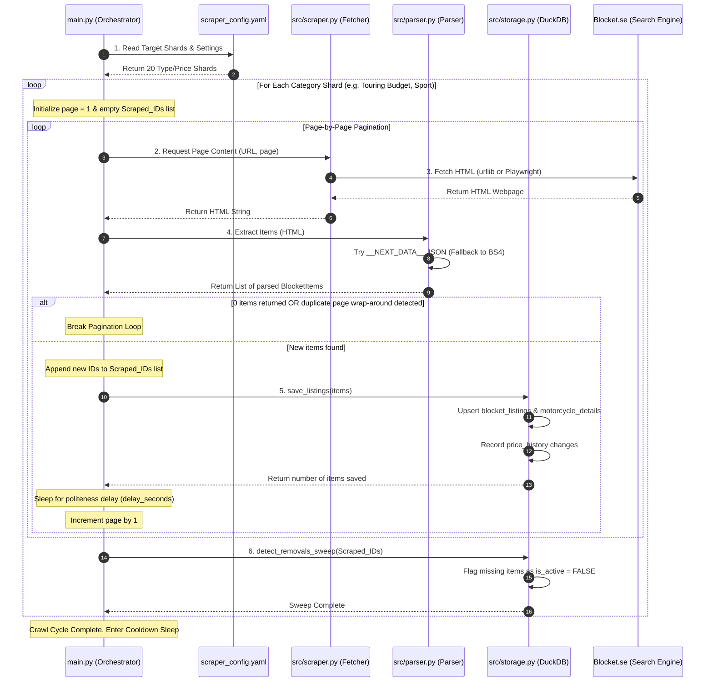

# 🇸🇪 Blocket Web Scraper (Remote worker pipeline)

This project is a high-performance web scraper designed to target Sweden's largest classifieds portal, **Blocket.se**, and execute completely remotely on your head node server over your secure Tailscale mesh network!

---

## 📂 Project Architecture

```text
blocket-webscraper/
├── .gitignore                   # Ignores local DuckDB DBs, test logs, and virtual environments
├── README.md                    # Setup and execution instructions
├── requirements.txt             # Packages: requests, beautifulsoup4, playwright, pydantic, pyyaml
├── run_remote.sh                # 🚀 Pipeline Runner (syncs, runs remotely, downloads results)
├── main.py                      # Main orchestrator entry point
│
├── config/
│   └── scraper_config.yaml      # Search keywords, categories, throttles, and db settings
│
└── src/
    ├── parser.py                # Extracts Next.js __NEXT_DATA__ JSON (CSS bypass!)
    ├── scraper.py               # Handles static HTTP loads and dynamic Playwright drivers
    └── storage.py               # Handles DuckDB deduplicated storage pipelines
```

## 🔄 Execution Sequence

The sequence diagram below visualizes how the scraper handles the sharded categories list, paginates dynamically, bypasses pagination caps, performs JIT details parsing, records price changes, and triggers deactivation scans:



---

## ⚡ Execution Models

### Model A: Direct Remote Pipeline (Recommended) 🚀
Run a single command on your Command Center:
```bash
bash run_remote.sh
```

**What this script automates:**
1. **Syncs Code**: Uses `rsync` to sync your local scraper codebase directly to your remote server (`101010_remote`), ignoring database files or virtualenvs.
2. **Prepares Host**: SSHs in, auto-creates a remote virtual environment, and resolves all pip requirements on the server.
3. **Runs Scraper**: Triggers `python3 main.py` on your remote server to run the scraper in the background (avoiding bandwidth or memory consumption on your local machine).
4. **Retrieves Data**: Downloads the updated DuckDB database `scraped_listings.duckdb` directly back to your local `data/` folder for analysis.

---

### Model B: Local Execution (Sandbox testing)
To test things locally before sending them to the server:

1. **Initialize a virtual environment & install requirements**:
   ```bash
   python3 -m venv venv
   source venv/bin/activate
   pip install -r requirements.txt
   ```
2. **Trigger the run**:
   ```bash
   python3 main.py
   ```
   *(Options: `--browser` forces headless Chromium via Playwright, default is static HTTP)*
