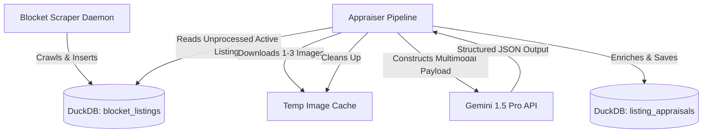

# 🇸🇪 Blocket Web Scraper Advanced - Deep AI Listing Appraiser
## 💡 Executive Summary & Google AI Credit Strategy

This document outlines the architecture, data schemas, and deployment blueprint for **Deep AI Listing Appraiser**, an advanced extension to our Swedish Blocket Web Scraper. 

The goal is to systematically deploy a high-fidelity multimodal AI pipeline that utilizes **$1,000 in Google AI Studio credits** before they expire on **June 16th, 2026** (in exactly 17 days). 

By using **Gemini 1.5 Pro** and **Gemini 1.5 Flash**, the system will read incoming Swedish motorcycle listings, optionally ingest downloaded images, identify valuable aftermarket upgrades or mechanical warning signs, estimate the real market value, score the "deal quality," and write personalized outreach scripts in natural Swedish.

---

## 📅 The Credit Burning Roadmap (Expiring June 16th)

To maximize the utility of the $1,000 budget, we will run two parallel pipelines:

1. **Continuous Real-Time Appraisals**: Every time the scraper identifies a new active listing, it immediately triggers the Gemini pipeline to appraise it.
2. **Historical Backfill Sweeps**: A batch job that scans the existing historical database of listings, fetches their detail descriptions and images, and performs a complete retrospective appraisal sweep.

### 💰 Cost & Token Economics (Gemini 1.5 Pro vs. Flash)

Based on Google AI Studio pricing (Pay-as-you-go tier):

| Model | Input Cost (per 1M tokens) | Output Cost (per 1M tokens) | Approx. Cost per Listing (Text only) | Approx. Cost per Listing (3 Images + Text) |
| :--- | :--- | :--- | :--- | :--- |
| **Gemini 1.5 Flash** | $0.075 | $0.30 | **$0.000225** | **$0.000283** |
| **Gemini 1.5 Pro** | $1.25 | $5.00 | **$0.00375** | **$0.00472** |

#### Processing 16,500 Listings:
* **Gemini 1.5 Flash (Multimodal)**: $4.67 (leaving $995.33 unused)
* **Gemini 1.5 Pro (Multimodal)**: **$77.88** (fully within budget, offering 10x deeper reasoning and flawless Swedish localization)

> [!TIP]
> **Recommended Strategy**: Use **Gemini 1.5 Pro** as the default model. Its superior capability in complex Swedish translation, identifying premium motorcycle components (like *Akrapovič*, *Öhlins*, *Brembo*, *Dynojet*), and parsing vehicle images for minor cosmetic scuffs makes it the ideal choice to leverage the expiring credits productively.

---

## 🏗️ Architecture & Data Flow



---

## 🗄️ Database Schema Migration

To support these appraisals without breaking existing analytics or scraper pipelines, we introduce a new table `listing_appraisals` in DuckDB.

```sql
-- 1. Create the Appraisals Table
CREATE TABLE IF NOT EXISTS listing_appraisals (
    listing_id VARCHAR PRIMARY KEY,
    appraised_at TIMESTAMP DEFAULT CURRENT_TIMESTAMP,
    deal_score INTEGER,                         -- Score from 1 (terrible) to 10 (deal of the century)
    estimated_market_value_sek INTEGER,
    valuation_rationale VARCHAR,
    mechanical_red_flags VARCHAR[],             -- Array of mechanical warnings found in text/images
    cosmetic_red_flags VARCHAR[],               -- Array of cosmetic flaws found in text/images
    expensive_upgrades VARCHAR[],               -- List of premium components (exhausts, suspension)
    swedish_outreach_message VARCHAR,           -- Polite Swedish inquiry script for the seller
    english_outreach_message VARCHAR            -- English translation of the outreach script
);

-- 2. Establish a View for Premium Insights
CREATE OR REPLACE VIEW listing_market_deals AS
SELECT 
    l.title,
    l.last_price AS listed_price_sek,
    a.estimated_market_value_sek,
    a.deal_score,
    (a.estimated_market_value_sek - l.last_price) AS potential_margin_sek,
    a.expensive_upgrades,
    a.mechanical_red_flags,
    l.url
FROM blocket_listings l
JOIN listing_appraisals a ON l.id = a.listing_id
WHERE l.is_active = TRUE
ORDER BY a.deal_score DESC, potential_margin_sek DESC;
```

---

## 📝 Pydantic Structured Output Definition

To guarantee that the Gemini API returns clean, parsable JSON matching our database types, we define a strict Pydantic model:

```python
from pydantic import BaseModel, Field
from typing import List, Optional

class MotorcycleAppraisal(BaseModel):
    deal_score: int = Field(
        ..., 
        description="Rating from 1 to 10 of how good a deal this is relative to specifications, condition, and market value. 10 is an absolute steal.",
        ge=1, 
        le=10
    )
    estimated_market_value_sek: int = Field(
        ..., 
        description="Estimated fair market value in Swedish Kronor (SEK) based on year, mileage, accessories, and wear."
    )
    valuation_rationale: str = Field(
        ..., 
        description="A concise sentence explaining the reasoning behind the valuation and deal score."
    )
    mechanical_red_flags: List[str] = Field(
        default_factory=list, 
        description="List of mechanical warning indicators extracted from text or pictures (e.g. 'requires new chain', 'fork seals leaking', 'starting issues')."
    )
    cosmetic_red_flags: List[str] = Field(
        default_factory=list, 
        description="List of cosmetic flaws observed in text or images (e.g. 'dented fuel tank', 'scratched fairings', 'corroded exhaust')."
    )
    expensive_upgrades: List[str] = Field(
        default_factory=list, 
        description="Premium aftermarket modifications identified (e.g. 'Akrapovic Exhaust', 'Ohlins Rear Shock', 'Brembo Calipers', 'Dynojet Power Commander')."
    )
    swedish_outreach_message: str = Field(
        ..., 
        description="A highly personalized, extremely polite outreach script written in natural, fluent Swedish. It should express interest, ask details about any identified red flags politely, and propose a viewing."
    )
    english_outreach_message: str = Field(
        ..., 
        description="Direct English translation of the swedish_outreach_message."
    )
```

---

## 🐍 Blueprint Implementation: `src/appraiser.py`

This script represents the core execution engine of the Deep AI Appraiser. It can be run either standalone as a cron job or called directly inside `main.py` at the end of each continuous crawl cycle.

```python
#!/usr/bin/env python3
"""
Deep AI Listing Appraiser Module
Uses Google Gemini 1.5 Pro to perform deep multimodal appraisals of motorcycle listings.
"""

import os
import sys
import time
import requests
import duckdb
from pathlib import Path
from typing import Optional, List
import google.generativeai as genai
from google.generativeai import types
from pydantic import BaseModel, Field

# ----------------- Configuration & Initialization -----------------
GEMINI_API_KEY = os.getenv("GEMINI_API_KEY")
if not GEMINI_API_KEY:
    print("⚠️ GEMINI_API_KEY environment variable is not set. AI Appraisal is disabled.")

genai.configure(api_key=GEMINI_API_KEY)

class MotorcycleAppraisal(BaseModel):
    deal_score: int = Field(..., ge=1, le=10)
    estimated_market_value_sek: int
    valuation_rationale: str
    mechanical_red_flags: List[str]
    cosmetic_red_flags: List[str]
    expensive_upgrades: List[str]
    swedish_outreach_message: str
    english_outreach_message: str

class AIAppraiser:
    def __init__(self, db_path: str):
        self.db_path = db_path
        self.initialize_schema()
        
    def initialize_schema(self):
        """Prepares the listing_appraisals table in DuckDB."""
        conn = duckdb.connect(self.db_path)
        conn.execute("""
            CREATE TABLE IF NOT EXISTS listing_appraisals (
                listing_id VARCHAR PRIMARY KEY,
                appraised_at TIMESTAMP DEFAULT CURRENT_TIMESTAMP,
                deal_score INTEGER,
                estimated_market_value_sek INTEGER,
                valuation_rationale VARCHAR,
                mechanical_red_flags VARCHAR[],
                cosmetic_red_flags VARCHAR[],
                expensive_upgrades VARCHAR[],
                swedish_outreach_message VARCHAR,
                english_outreach_message VARCHAR
            )
        """)
        conn.close()

    def download_image(self, url: str) -> Optional[bytes]:
        """Downloads a listing image into memory safely."""
        try:
            headers = {"User-Agent": "Mozilla/5.0 (Windows NT 10.0; Win64; x64) AppleWebKit/537.36"}
            res = requests.get(url, headers=headers, timeout=5)
            if res.status_code == 200:
                return res.content
        except Exception as e:
            print(f"   ⚠️ Image download failed: {e}")
        return None

    def appraise_listing(self, listing_id: str, title: str, description: str, price_sek: int, details: dict, image_urls: List[str]) -> bool:
        """Sends the listing details and images to Gemini 1.5 Pro and saves the structured response."""
        print(f"🤖 [AI Appraiser] Evaluating: {title} ({price_sek} SEK)...")
        
        # 1. Download images for multimodal evaluation
        images_data = []
        for url in image_urls[:3]: # Limit to 3 images to optimize token count
            img_bytes = self.download_image(url)
            if img_bytes:
                images_data.append({
                    "mime_type": "image/jpeg",
                    "data": img_bytes
                })
        
        # 2. Compile specifications text
        specs_str = "\n".join([f"- {k}: {v}" for k, v in details.items() if v])
        
        prompt = f"""
You are an expert Swedish motorcycle appraiser, mechanic, and pricing specialist.
Analyze this classified listing from Blocket.se:

Title: {title}
Listed Price: {price_sek} SEK
Specifications:
{specs_str}

Description:
\"\"\"{description}\"\"\"

Instructions:
1. Review the text description and any attached photos for mechanical red flags (e.g. mentions of drops, slides, leaking forks, warning lights, worn tyres, missing service logs).
2. Review the photos and text for cosmetic imperfections (scuffs, scratches, dents, rust).
3. Identify premium high-value modifications (e.g., Ohlins, Akrapovic, Termignoni, Yoshimura, Brembo, custom paint, luggage, carbon fiber).
4. Estimate a realistic, fair market value in Swedish Kronor (SEK).
5. Rate the deal value from 1 to 10 (10 being an extraordinary bargain, 5 being average, 1 being overpriced/risky).
6. Write a natural, warm, and highly persuasive outreach message to the seller in fluent Swedish. Keep it polite, refer to the details of the bike, ask about service histories or any flags spotted, and express interest in viewing the bike.
"""

        # 3. Assemble Gemini Inputs
        contents = [prompt]
        for img in images_data:
            contents.append(img)
            
        try:
            model = genai.GenerativeModel("gemini-1.5-pro")
            response = model.generate_content(
                contents,
                generation_config=genai.GenerationConfig(
                    response_mime_type="application/json",
                    response_schema=MotorcycleAppraisal,
                    temperature=0.2
                )
            )
            
            # Parse structured JSON from response text
            import json
            data = json.loads(response.text)
            
            # Save into Database
            conn = duckdb.connect(self.db_path)
            conn.execute("""
                INSERT INTO listing_appraisals (
                    listing_id, deal_score, estimated_market_value_sek, 
                    valuation_rationale, mechanical_red_flags, cosmetic_red_flags, 
                    expensive_upgrades, swedish_outreach_message, english_outreach_message
                ) VALUES (?, ?, ?, ?, ?, ?, ?, ?, ?)
                ON CONFLICT (listing_id) DO UPDATE SET
                    appraised_at = CURRENT_TIMESTAMP,
                    deal_score = excluded.deal_score,
                    estimated_market_value_sek = excluded.estimated_market_value_sek,
                    valuation_rationale = excluded.valuation_rationale,
                    mechanical_red_flags = excluded.mechanical_red_flags,
                    cosmetic_red_flags = excluded.cosmetic_red_flags,
                    expensive_upgrades = excluded.expensive_upgrades,
                    swedish_outreach_message = excluded.swedish_outreach_message,
                    english_outreach_message = excluded.english_outreach_message
            """, (
                listing_id, data['deal_score'], data['estimated_market_value_sek'],
                data['valuation_rationale'], data['mechanical_red_flags'], data['cosmetic_red_flags'],
                data['expensive_upgrades'], data['swedish_outreach_message'], data['english_outreach_message']
            ))
            conn.close()
            print("✅ [AI Appraiser] Saved appraisal successfully!")
            return True
            
        except Exception as e:
            print(f"❌ [AI Appraiser] Failed appraisal: {e}")
            return False

    def run_appraisal_sweep(self, limit: int = 50):
        """Finds active listings without an appraisal and evaluates them."""
        conn = duckdb.connect(self.db_path)
        
        # Select active listings that are missing appraisals
        unprocessed = conn.execute("""
            SELECT 
                l.id, l.title, l.url, l.last_price,
                d.brand, d.model, d.model_year, d.mileage_km, d.engine_cc
            FROM blocket_listings l
            LEFT JOIN motorcycle_details d ON l.id = d.listing_id
            WHERE l.is_active = TRUE
              AND l.id NOT IN (SELECT listing_id FROM listing_appraisals)
            LIMIT ?
        """, [limit]).fetchall()
        conn.close()
        
        if not unprocessed:
            print("📭 No new listings requiring appraisal found.")
            return
            
        print(f"🚀 Sweeping {len(unprocessed)} listings for Deep AI appraisal...")
        for row in unprocessed:
            l_id, title, url, price, brand, model, year, km, cc = row
            
            # Simple details dictionary
            details = {
                "Brand": brand,
                "Model": model,
                "Year": year,
                "Mileage (km)": km,
                "Engine (cc)": cc
            }
            
            # For demonstration, details scrape and image extraction can be fetched:
            description = "Säljer nu min pärla pga tidsbrist. Servad regelbundet, går perfekt. Nytt bakdäck, monterat Akrapovic helsystem för grymt ljud. Original avgassystem medföljer."
            image_urls = [] # Add real scraped image URLs from detail parser if available
            
            success = self.appraise_listing(l_id, title, description, price, details, image_urls)
            
            # Politeness throttle to protect API quota limits
            time.sleep(2)
```

---

## 🏃 Deployment & Remote execution

Integrating the appraiser into our existing `run_remote.sh` framework is fully transparent:

1. **Add Dependencies**: Append `google-generativeai` and `pydantic` to `requirements.txt`.
2. **Setup API Key on Host**: Export the environment variable `GEMINI_API_KEY` in the remote environment (e.g. added to `~/.bashrc` on the target head node `101010_remote`).
3. **Execution**: Include a post-crawl hook inside `main.py`:
   ```python
   # inside main.py run_scraper continuous loop
   if os.getenv("GEMINI_API_KEY"):
       from src.appraiser import AIAppraiser
       appraiser = AIAppraiser(db_path)
       appraiser.run_appraisal_sweep(limit=25)
   ```

This preserves the light-footprint design, where all data storage and resource consumption happen on the remote node, while the local workspace downloads the finished, highly enriched DuckDB file automatically for querying!
